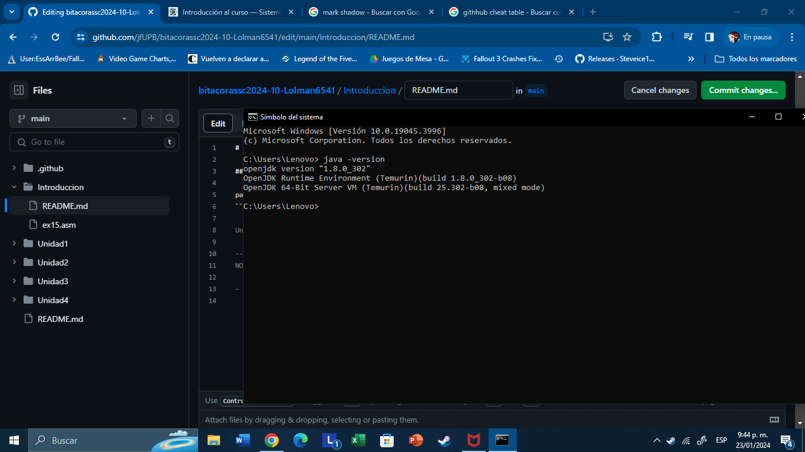
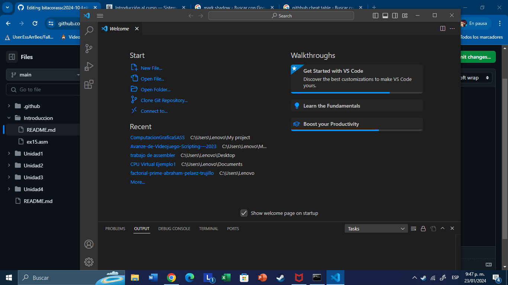
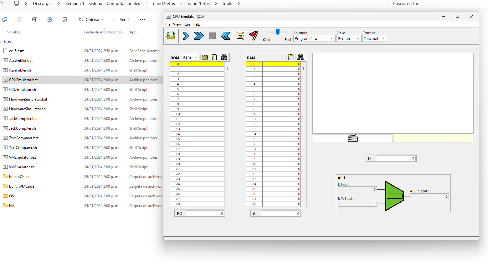
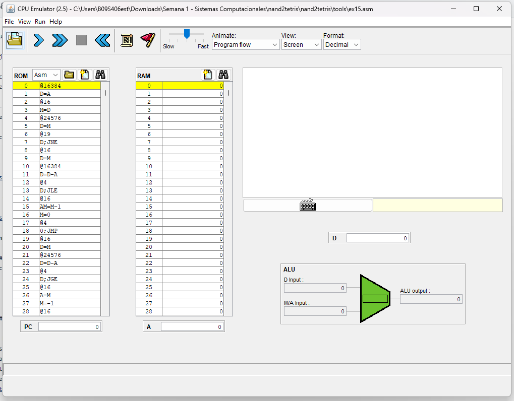
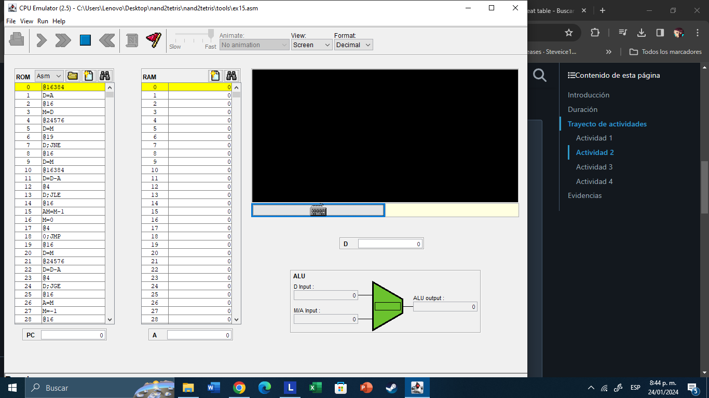

# Bitácora de aprendizaje
# Bitácora de aprendizaje - Primera Clase - Lunes 22 de Enero

## Subtitulos

Para agregar una lista de codigo, en un cadro de texto como este:
``` c
Una guia de ejemplo en donde irian los comandos de codigo
```
Se usan tres comillas (´´´) junto a una C para generar un cuadro de codigos.
Y para finalizarlo se cierran con otras tres comillas, al final de la linea de codigo.

- De por si el curso abarca el tema en como es que funciona el HardWare de una computado o PC
y que procesos llevan al cabo a tal funcion junto a los a los lenguajes de programación y sus herramientas.

- En mi caso ya habia visto este curso pero me habia ido mal, dado que no entendia para nada este tema,
debo de decir que se me hace muy duro la programación, pero debo de esforzarme para asi poder ganarlo e incluso 
enteder un poco mas de esto. Espero que me vaya bien y no se complique (no mucho) el curso. 
Debo respasar este fin de semana todo lo que vimos en la introducción. 

--------------------------------------------------------
NOTA: No se te olvide pegar o copiar en elace a la pagina con la lista dde codigos para organizar el texto

# Dia Autonomo - Martes 23 de Enero

## De lo que se puede decir, es que no habia mucho que hacer. Aun no entendia como usar un poco la bitacora
mas que todo el separador de cuadros de textos cuando se agregar el contenido a ese cuadro.

- Resulta y acontece de que ya tengo ambas versiones de los programas o herramientas que necesita descargar e instalar

Java



Visual Studio Code



--------------------------------------------------------------------------------------------

# Introducción al Flujo de Trabajo - Segunda Clase - Miercoles 24 de Enero

## Actividad # 1
- Debo de descargar un archivo y ejecutar el programa de CPUEmulator.bat .
- Siempre hay que asegurace de que los programas tenga habilitada la extensiones de nombre.




## Actividad # 2

- Vamos abrir NotePadd por ahora.
- Y copiaremos el codigo que nos manda el profesor a copiar, en el bloc de notas y
renombrar el archivo como ex15.asm. Es importante que el bloque de texto, se le cambie
la extesion .txt por .asm .
- Ahora nos dedicaremos a cargaren la memoria ROM el archivo que creamos:
  


- Se verifica que no haya errores cada vez que se modifique el ROM, estos suelen siempre suelen tener textos rojos
- Ahora pondremos a prueba el programa y ajustaremos ciertas cosas para que cargue rapido este y que funcionen.



- Se aprecia que al apretar y mantener una tecla (cualquiera) la pantalla que muestra el programa carga todo en negro
y al dejar de presionar la pantalla se vuelve blanca.

- Tengo que prestar mas atención a lo que dice el profesor, pero a la vez se me dificulta un poco seguir el ritmo
dado que ando en la pantalla del Computador siguiendole los pasos. Al menos el profesor me ayudo resolver mis dudas 
que tenia con el uso de las comillas para separar los cuadros de codigos. Debo de repasar la introducción.
