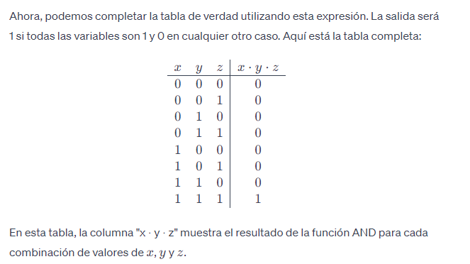
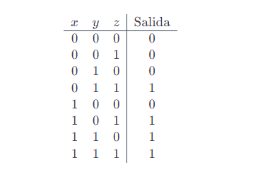

# Bitácora de aprendizaje - Unidad 1. Arquitectura del Comuputador

## Semana 2 

### Lunes 29 de enero

#### Micro-Sesión 1: Apertura

Para este principio de la primera unidad, nos encargaremos en estudiar en cómo funciona un computador digital moderno entendiendo 
cómo hace este para ejecutar un programa en lenguaje ensamblador y la relación entre el lenguaje ensamblador y código de alto nivel. 

Al comienzo habra Reto que habra que ir haciendo al lapso de esta semana que consiste en construir una aplicación
que debe funcionar en ciclo infinito en CPUEmulator.bat y que esta imprima en la pantalla dependiendo de la tecla que aprietes
segun tu primera y ultima letra de tu apelliddo.

Es recomendable el leer o ver videos tutoriales para empezar hacer el reto que propone el profesor, dado que hay que demostrar en 
que entendimos ciertos conceptos para poder seguir avanzado el reto. No hay que responder todas las preguntas que plantea la unidad, 
pero seria lo recomendable que se evidencia algo del trabajo. Tambien podemos empezar a tirar codigo y crear el ejecutable ex15.asm
en el GitHub.

### Micro-Sesión 2: Investigación - Preguntas Guía Iniciales

1.  Selecciona una función booleana. Representa dicha operación de dos maneras diferentes. ¿Pudiste observar en el video esas dos maneras?
  
 R/= Como tal podremos usar una tabla de verdad (Verdadero o Falso) que tambien podriamos decir que es:

 Sí   o  No
 On   o  Off
 True o  False 

Junto a las expresiones:

- AND: La salida es verdadera solo si todas las variables son verdaderas.

                             Z . X . Y

- OR: La salida es verdadera si al menos una de las variables es verdadera.

                             Z + X + Y

- XOR: La salida es verdadera si exactamente una de las variables es verdadera.

                             Z ⊕ X ⊕ Y

- NOT: La salida es el inverso de la entrada.

                             _ _ _
                             Z X Y            

Para el primera caso usara la tabla de la verdad junto la expresion AND:



Ahora lo usaremos junto el Logic Gate junto a la expresión AND:

 ``` c
          _________
          |         \
   x ----|          AND ----\
          |_________/       \
                             AND ---- Output
          _________         /
          |         \       /
   y ----|          AND --/
          |_________/
                             
          _________
          |         \
   z ----|          AND
          |_________/

```

#### Micro sesión 3: Cierre 

Hasta el momento ando revisando la primera pregunta y en ver de que va las expresiones Boolenas asumo que la primera pregunta me pide 
en que operaciones se puede represantar estas, se de dos que son expresión booleana y una tabla de verdad, como tal se que los valores Booleanos
siempre sera DOS fijos, ni a medias o nitades, siempre seran un SI o NO, Verdadero o Falso y asi sucesivamente. Debo de repasar este tema y pedirle
ayuda a ChatGPTE en enteder mas este tema. Dejare esta reflexion por ahora y voy ver si en el transcurso de la semana avanzo en algo.....

### Miercoles 31 de enero

#### Micro-Sesión 1: Apertura

2. Inventa una tabla de verdad de tres entradas y una salida. ¿Cuál es la función booleana que la representa?

R/=  Inventamos una función que devuelve verdadero (1) si al menos dos de las tres entradas son verdaderas (1), y falso (0) en cualquier otro caso.

   ## Función => (x,y,z)=(x⋅y)+(x⋅z)+(y⋅z)

   Esta función representa la lógica "al menos dos de las tres son verdaderas". Ahora, podemos construir la tabla de verdad:

   

Esta tabla de verdad representa la función booleana que hemos definido, donde la salida es verdadera (1) 
si al menos dos de las tres entradas son verdaderas (1), y falso (0) en cualquier otro caso.

#### Micro sesión 2: Cierre 
Hoy por hoy, me dedique a completar el primer punto dado que lo tenia incompleto del primer día.
Tambien me dedique a en hacer la pregunta 2 y ver los videos 1.2 y 1.3. De lo que tengo entendido es que una
Compuerta Logica es un componente electroinico encargado de operar entradas para producir una señal de salida
que en si es una tabla de verdad (¿creo?). Tambien el profesor me colaboro con unos ajustes en como crear un repositorio
privado y en como agregar colaboradores a este. Resulta que mi error era que habia ingresado con otro correo.
Debo de repasar estos videos de la actividades que coloque y apartar dudas para la proxima clase.

### Domingo 4 de Febreo - Día Autonomo

#### Micro-Sesión 1: Apertura
3. ¿Como seria el circuto logico que representa la función booleana?
   
R/= Función(x,y,z)=(x⋅y)+(x⋅z)+(y⋅z) con compuertas lógicas, podemos construir el circuito utilizando compuertas AND, OR y NOT. Aquí está el diseño del circuito: 

``` c
          _________
         |         \
    x ---|          AND ----\
         |_________/       \
                              \
    x ---|          AND ----\  \
         |_________/       \  OR --- Output
                              /
    y ---|          AND ----/  /
         |_________/       /
                             /
    y ---|          AND ---/
         |_________/
                             
    z ---|          AND
         |_________/
    z ---|

```

En este circuito:
-Las entradas x, y , z están conectadas a puertas lógicas AND individuales.

- Las salidas de estas puertas AND se conectan a puertas lógicas OR, que realizan la operación de suma lógica (x⋅y)+(x⋅z)+(y⋅z).

- La salida de la puerta OR es la salida del circuito.

- Este circuito implementa la función booleana deseada utilizando compuertas lógicas estándar.

4.  ¿Cuántos números diferentes puede representar un computador de 8 bits?
   
R/= Un computador de 8 bits puede representar 2^8 = 256 numeros diferentes.
Lo recomendable no usar todos esos valores en solo los numeros positivos, 
mas bien usar la mitad de este en 127 numeros positivos, 0 y 127 numeros negativos.   

5. ¿Cuál es la representación binaria del número en 8 bits del número 128?

R/= Seria 128 = 1 0 0 0 0 0 0 0 0 


6. ¿Qué es un overflow en una suma binaria? inventa un ejemplo.

R/= Un overflow en una suma binaria, ocurre cuando los ultimos digitos de la operación se suma y 
dan como resultado un 1 mas para agregar. En este caso lo mejor es que simplemente  no hagamos nada con el, 
y nos que demos como quedo el resultado final.

         1 0 1 0 1 1 0 1
       + 1 1 0 1 1 1 1 1
       ___________________ 
         1 0 0 0 1 1 0 0 

Al final de la operacion me quedaba un 1 demas por agregar, pero no se puede por que no hay nada que hacer por el.

#### Micro sesión 2: Cierre 
Al fin logre entender en si (creo), en como funciona o se convierte un numero entero a numero binario, 
el cual conciste en dividir el numero entero por dos, y seguir diviendo el resultado de la operación anterior
hasta quede 1 (1/2 = 0), despues con los resultados sacados de la abstración de numero, se usan para crear el numero binario,
estos siempre se lee de manera inversa, es decir el ultimo resultado de la abstración es el primero que se lee y el primero es 
ultimo en ser leido. Recuerda que si el numero es divisible por dos exacto el resultado en la abstracion es 0 y si no es divisible
exacto sera un 1. y claro junto a la suma Overflow, solo que creo que varia segun el numero de bits.

En lo demas creo que voy entendiendo de a poquito, aun asi me parece un gran paso en haber captado en como se crean los 
numeros binarios, espero que puede seguir entendiendo el tema hasta que le coja el tiro.

----------------------------------------------------------------------------------------------------------------------------------------

## Semana 3 

### Lunes 5 de febreo

#### Micro sesión 1: Apertura 


Como tal hoy nos dedicamos en trabajar en un programa o mas bien un videojuego rompecabeza, llamado 
Silicon Zeroes, el cual replica la construcción compleja de componentes electronicos/digitales como adders, latches
y multiplexers.  

Un sistema digital es un conjunto de elementos binarios relacionados entre si de alguna manera. Se
distinguen dos tipos de variables en un sistema digital. Las variables de entrada y las variables de salida que
dependen de las de entrada. Cuando cada combinación de las variables (Vector de entrada) de entrada se corresponde con una y sólo
una combinación de las variables de salida (Vector de salida), se trata de un sistema combinacional. Dicho de
otra manera, siempre que se repita un conjunto de valores de las variables de entrada, se repetirá la salida.

Cuando las funciones lógicas son muy complejas no siempre el diseño basado en la minimización y
posterior implementación con compuertas lógicas, es el más adecuado. Estos bloques funcionales MSI, si
bien a veces tienen fines específicos, pueden aplicarse a la implementación de funciones lógicas de muchas
variables. Las ventajas caen en la disminución de los CI necesarios, del tiempo de diseño, del número de
conexiones externas y facilita el mantenimiento.

#### Micro sesión 2: Codificadores
- Permiten codificar las líneas de entrada. Generalmente codifican en binario o BCD. 
- Si ninguna entrada está activa las salidas son todas cero, igual que si estuviera activada la entrada D0.
- Para evitar este problema los codificadores cuentan con una salida adicional que indica la ausencia de activación
  de las entradas.
- Por último los codificadores suelen contar con una entrada de habilitación. Cuando el chip está activado
  es válida la tabla de verdad, si no lo está el chip no funciona.
  
#### Micro sesión 3: Decodificadores
- Son Combinacionales que poseen n entradas y m salidas.
- El orden adecuado de la salida se activa cuando la codificación correspondiente se inyecta ala entrada.
- Generalmente son binarios o BCD. En caso de un decodificador binario si tiene n entradas poseerá m = 2n salidas. 
  Así un decodificador realiza lo opuesto a un codificador.

#### Micro sesión 4: Multiplexores
 - Disponen de m = 2n líneas de entrada (canales), una línea de salida y n líneas de selección. En función
   de las líneas de selección determina qué entrada aparece en la salida.
 - Los multiplexores, además de multiplexar, pueden usarse eficazmente para implementar funciones lógicas.
 - Para realizar multiplexores de muchos canales pueden combinarse diferentes multiplexores.

#### Micro sesión 5: Cierre

Dado el caso con el videojuego de Silicon Zeroes y en sí el tema, busca que las personas entiendan 
en como los componentes electronicos y digitales funcionan en los gadgets/dispositivos, junto 
en como implementarlos en estos, para que se puede ahorrar espacio/almacenamiento e incluso
en reducir o simplificar el proceso o tarea que se este ejecutando, para que le tome tanto el 
CPU en hacer.
Ya por aparte con el mismo videojuego (recalco que me descargue una demo) logre llegar hasta el desafio "Memsum"
el cual me costo en entender, hasta que cai en cuenta que "read" se encargaba de imprimir los valores que estaban
guardados en memoria, por lo tanto debia de usar el resultado de read y sumarlo con el "adder" para asi poder hallar el 
numero 7 que me pedian. En general no parece que se duro en entender (creo), mas que todo en como se lee. Recomendable hacer mas de estos ejercicios.

### Unidad 1: Miercoles 7 de Febrero

### Micro-Sesión 1: Apertura

Lo que hizimos al principio fue hablar sobre como deberiamos en organizar nuestras bitacoras con ayuda 
de los atajos o comandos que usa Github que es MarkDown. Tal cual como se muestra en el ejemplo de abajo:

``` c

## SEMANA 3
###Unidad 1: Miercoles Febrero 7
#### Micro-Sesión 1 :Apertura
#### Micro-Sesión 2: Cierre

```
Asi nos recomienda que lo dejemos de ahora en adelante.

Luego de eso nos pusimos a trabajar en el CPUEmulator con este codigo:

``` c

// Instrucción tipo A
//@numeroPositivo
@25
// Instrucción tipo C
// destino = operación;salto
// operación
@69
D=A

```
La primera instrucción carga el valor 25 en algún registro o dirección de memoria. La segunda instrucción mueve el valor almacenado en la dirección de memoria o registro especificado por el número 69 al registro D. Entonces, básicamente, este código manipula valores en la memoria o registros de la computadora, asignando el valor 25 a alguna ubicación y luego moviendo otro valor desde una ubicación específica (determinada por el número 69) al registro D.

#### Micro sesión 2: Cierre

El código ensamblador es un lenguaje de bajo nivel que permite a los programadores interactuar directamente con el hardware de la computadora. A diferencia de los lenguajes de alto nivel como Python o Java, el código ensamblador se traduce casi directamente en instrucciones de máquina que la CPU puede ejecutar. En resumen, trabajar con código ensamblador puede proporcionar una comprensión más profunda de cómo funcionan realmente las computadoras a nivel de hardware. Sin embargo, también puede ser complejo y requiere un conocimiento detallado de la arquitectura del procesador y las instrucciones específicas del conjunto de instrucciones.

### Jueves 8 de Febrero - Día Autonomo

#### Micro sesión 1: Apertura

Para esta sesión me dedique a resolver el reto que se no propuso en unidad 1, necesitamos escribir un código en lenguaje ensamblador que funcione en un ciclo infinito y lea el teclado para realizar las acciones especificadas. Aquí tienes un ejemplo de cómo podría ser este código para el simulador CPUEmulator.

``` c

main:
    ; Bucle infinito
    jmp main

    ; Rutina para leer el teclado
read_keyboard:
    ; Supongamos que la tecla presionada se almacena en el registro R1

    ; Verificar si la tecla presionada es la primera letra de tu primer apellido
    ; Si es así, muestra una imagen en la pantalla
    cmp R1, 'P'  ; Cambia 'P' por la primera letra de tu primer apellido
    je mostrar_imagen

    ; Verificar si la tecla presionada es la última letra de tu primer apellido
    ; Si es así, borra la pantalla
    cmp R1, 'a'  ; Cambia 'a' por la última letra de tu primer apellido
    je borrar_pantalla

    ; Si la última letra de tu apellido es la misma que la primera letra, toma la penúltima y así sucesivamente
    cmp R1, 'l'  ; Cambia 'l' por la segunda letra de tu primer apellido
    je tomar_penultima

    ; Si la tecla presionada no corresponde a ninguna de las condiciones anteriores, simplemente continua leyendo el teclado
    jmp read_keyboard

mostrar_imagen:
    ; Código para mostrar una imagen en la pantalla
    ; Esta parte del código dependerá del simulador CPUEmulator y de cómo se maneje la salida de gráficos

    ; Volver a leer el teclado
    jmp read_keyboard

borrar_pantalla:
    ; Código para borrar la pantalla
    ; Esta parte del código dependerá del simulador CPUEmulator y de cómo se maneje la salida de gráficos

    ; Volver a leer el teclado
    jmp read_keyboard

tomar_penultima:
    ; Código para tomar la penúltima letra del apellido y compararla con la primera letra
    ; Si son iguales, se repite el proceso de tomar la penúltima letra hasta encontrar una diferente
    ; Luego, se procede según la letra encontrada

    ; Volver a leer el teclado
    jmp read_keyboard

```
Este es un esquema básico del código. Debes reemplazar las letras 'P' y 'a' por la primera y última letra de tu apellido respectivamente, y ajustar las comparaciones de acuerdo con las letras de tu apellido. Además, debes completar las secciones que muestran una imagen en la pantalla, borran la pantalla y toman la penúltima letra según tus necesidades y las capacidades del simulador CPUEmulator.

#### Micro sesión 2: Cierre

La programación en ensamblador nos sumerge en los cimientos mismos de cómo funciona una computadora, lo que nos brinda un nivel de control y optimización que rara vez se encuentra en lenguajes de programación de más alto nivel. Si bien puede ser laborioso y detallado, el conocimiento adquirido al trabajar con ensamblador es invaluable: nos proporciona una comprensión profunda de la arquitectura del procesador y nos permite optimizar el rendimiento del programa al máximo. A través de este proceso, no solo ganamos habilidades técnicas, sino también una apreciación más profunda de la complejidad y el poder de la tecnología que utilizamos a diario.

----------------------------------------------------------------------------------------------------------------------------------

## Semana 4 

### Lunes 12 de febreo

#### Micro sesión 1: Apertura

Labels
Variables
Saltos 
I/O: Teclados, display

- Las variables en lenguaje ensamblador son áreas de memoria reservadas para almacenar datos temporales o valores
  que se utilizan durante la ejecución de un programa.se utilizan principalmente para almacenar datos temporales,
  como números, caracteres o direcciones de memoria, y pueden modificarse durante la ejecución del programa según sea necesario.

- Labels son símbolos utilizados para marcar ubicaciones específicas en el código fuente. Estas etiquetas se utilizan principalmente
  como referencias para saltos condicionales o incondicionales, y para definir puntos de entrada o salida en el programa.

- Los Saltos son instrucciones que controlan el flujo de ejecución del programa, permitiendo que éste pase de una parte
  del código a otra según ciertas condiciones o de manera incondicional. Saltos condicionales: Estos saltos se ejecutan 
  solo si se cumple una condición específica "je" que salta a una ubicación específica si dos valores son iguales.
  Saltos incondicionales: Estos saltos se ejecutan independientemente de cualquier condición.
  jmp (Jump), que siempre salta a la ubicación especificada.

#### Micro Sesión 2: Ejemplo

Ejemplo de clase:

El ejercicio nos pide que al presionar uan tecla debe de pintar loa primeros 16 pixeles
el programa debe recordar la primera posición de la pantalla (16384) que allique allí se 
almacenaran los primeros 16 pixeles.

Quiero guardar en  la posición 69 de la memoria el numero 16

@16
D=A
@69
M=D

Quiero encender los primero 16 pixeles de la pantalla del cual Los pixeles están 
mapeados a osiciones de la memoria que inician en la posición 16384
Si hay una tecla presionada pinto los 16 primeros pixeles, sino los pago.

Leer la posición 24576 que es la dirección donde esta mapeado el teclado
si lo qque leo es diferente de cero, entonces hayuna tecla presionada y 
debo pintar la pantalla sino entonces borro la pantalla.

```c

// Leer el teclado

(START)
@24576
D = M
@IF
D;JEQ
// ELSE
@16384
M = -1
@START
0;JMP
//Label
(IF)
@16384
M=0
@START
0;JMP

//Pinto la pantalla (Primero 16 pixeles)
@16384
M = -1

```

#### Micro Sesión 3: Cierre

Espero y aspiro que con el progreso de esta semana pueda entender mas el manejo de la creación de pixeles,
porque desafortunadamente no entendi como hacer la actividad RETO que nos pedia la Unidad 1 en crear una 
imagen al presionar una tecla y borrarla con otra (Voy a repetirlo). No esta del todo claro pero hoy mismo debo de
seguir trabajando en la actividad propuesta para hoy mismo.

-------------------------------------------------------------------------------------------------------------------------

### Miercoles 14 de febreo

#### Micro sesión 1: Apertura

Hoy por lo que nos pide el profesor es Contruir estos programas realizando pruebas intermedias para cada funcionalidad. 
Por ahora la primera actividad consiste en hacer un ejercicio en donde se analise el y comente lo que hace el programa.

### Micro sesión 2: Desarrollo


